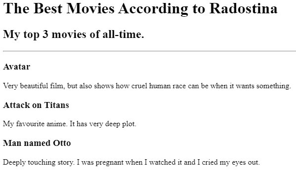
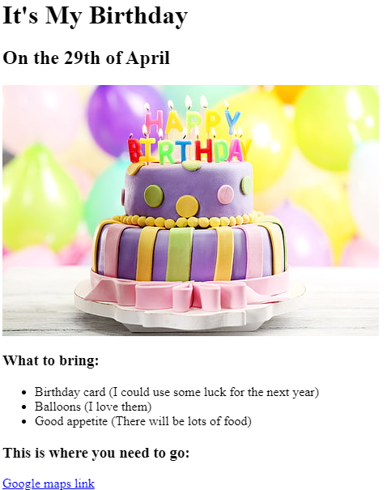

<!DOCTYPE html>
<html lang="en">
<head>
    <meta charset="UTF-8">
    <meta name="viewport" content="width=device-width, initial-scale=1.0">
    <title>Document</title>
</head>
<body>
    <h1>Radostina Uzunova's Portfolio</h1>
    <h2>I'm a baby Developer.</h2>
    

    <a href="./public/movie.html">Movie Rankig Project</a>
     
     
    
     

    <a href="./public/birthday.html">Birthday Invite Project</a>
     
     
    
     

    <a href="./public/about.html">About Me</a>
    <a href="./public/contact.html">Contact Me</a>
    

</body>
</html>
